# 项目

## 概述

- 此项目中包含运行在2D/3D均匀网格上的A*算法
- 为了适应游戏中各种不同的需求，此算法中有大量可自定义的部分
  - `PathFindingSettings`：中包含三个SO，分别用于调整计算距离的方式，获取相邻可达节点的方式，计算距离的方式
  - `PathFindingProcess`：寻路过程，A*的核心（不变）部分
  - `Node`：表示寻路过程中生成的节点，可以进一步派生，以适应更多需求
  - `MoverBase`：表示移动者，可以进一步派生，以适应更多需求

## PathFindingSettings

- 标准A* 的启发函数为FCost = GCost + HCost，而`hCostWeight`表示HCost额外乘的系数

| hCostWeight | 说明                       |
| ----------- | -------------------------- |
| 0           | 退化为Dijkstra算法         |
| 0~1         | 效率低于标准A*             |
| 1           | 标准A*                     |
| >1          | 找到路径更快，但不一定最短 |

## 获取相邻可达节点的方法

- 用于适应游戏中不同的移动方向（四向/八向...）
- 支持JPS算法

## 拓展

- A*算法可修改的部分主要由以下几个部分组成：
  - 计算Cost的方式
  - 判断能否从某点移动到另一点的方式
  - 获取周围**可达**节点的方式
- 从复用性和可拓展性角度考虑，可以使用委托

```c#
public class PathFindingSettings
{
    public int capacity;
    public int maxDepth;
    public Func<PathFindingProcess, float> CalculateWeight;
    public Func<Vector2Int, Vector2Int, float> CalculateHCost;
    public Func<Vector2Int, Vector2Int, float> CalculateGCost;
    public Action<PathFindingProcess, PathNode, List<PathNode>> GetAdjoinNodes;
    public Func<PathNode, PathNode, bool> MoveCheck;
    public Func<Vector2Int, ENodeType> DefineNodeType;
}
```

# 计算FCost的方式

```C#
/// <summary>
/// 规定HCost权重的方法
/// </summary>
public Func<PathFindingProcess, float> CalculateWeight;
/// <summary>
/// 计算HCost的方法
/// </summary>
public Func<Vector2Int, Vector2Int, float> CalculateHCost;
```

## 权重系数

- 启发函数变为FCost=GCost+ weight * HCost
- 可以证明：**weight * HCost < 实际距离时，算法总是能返回最短路径；权重系数越大，找到结果的速度越快**

| 权重系数 | 返回最短路径 | 说明                   |
| -------- | ------------ | ---------------------- |
| 0        | 是           | 退化为BFS/Dijkstra算法 |
| 1<       | 是           | 效率不如标准A*         |
| 1        | 是           | 标准A*                 |
| >1       | 不一定       | 效率高于标准A*         |

- 可以尝试使用动态权重系数

## 计算HCost的方式

- 可以适应不同的可选移动方向
  - 四向移动：曼哈顿距离
  - 八向移动：对角线距离
  - 六向移动

## 计算GCost的方式

```C#
/// <summary>
/// 计算GCost的方法
/// </summary>
public Func<Vector2Int, Vector2Int, float> CalculateGCost;
```

- 可以适应困难地形、不同移动方式等需求

# 判断能否从一点移动到另一点的方式

```C#
/// <summary>
/// 获取相邻节点的方法
/// </summary>
public Action<PathFindingProcess, PathNode, List<PathNode>> GetAdjoinNodes;
/// <summary>
/// 判断能否移动的方法
/// </summary>
public Func<PathNode, PathNode, bool> MoveCheck;
/// <summary>
/// 确定节点类型的方法
/// </summary>
public Func<Vector2Int, ENodeType> DefineNodeType;
```

- 可以适应的可选移动方向，以及
  - 四向移动
  - 自由八向移动
  - 受限八向移动：贴墙时不能走对角线
  - 六向移动

```C#
public static bool CheckPassable_Default(PathNode from, PathNode to)
{
    return to.Type != ENodeType.Obstacle;
}

private ENodeType DefineNodeType(Vector2Int nodePos)
{
    Vector3 world = NodeToWorld(nodePos);
    Vector3Int tilePos = map.WorldToCell(world);
    RuleTile tile = map.GetTile(tilePos) as RuleTile;
    if (tile != null)
    {
        if (tile.m_DefaultSprite.name == "Block")
            return ENodeType.Obstacle;
    }
    return ENodeType.Blank;
}
```

# 获取相邻节点的方式

```C#
/// <summary>
/// 获取相邻节点的方法
/// </summary>
public Action<PathFindingProcess, PathNode, List<PathNode>> GetAdjoinNodes;
```

# 算法

## A*

- 自然语言描述
  1. 设置起点终点，将起点加入**open**，用**N**记录最接近结果的点，**N**一开始设为起点（不论寻路是否正常完成，最终都从**N**开始回溯结果）
  2. 从**open**中取出堆顶节点（记为**A**）
  3. 获取**A**周围可达节点，记为**adjoin**
  4. 对于**adjoin**中的每个节点进行以下操作：
     - 如果该节点没有父节点，就将其父节点设为**A**
     - 如果是终点，将该节点的父节点设为**A**，并将**N**设为该节点，然后返回结果
     - 如果是未访问过的节点，加入open
     - 如果是open中的节点，如果从**A**移动到该点比从该点原本的父节点走到该点的GCost更小，那么将该节点的父节点改为**A**
     - 如果该节点的HCost小于**N**的HCost，将**N**设为该点；如果**N**是终点，寻路完成
  5. 将**A**标记为**close**
  6. 如果**open**不为空，回到2；否则返回结果


## 2D-JPS


*左：0为自然邻居；右：0，1，2为自然邻居*


*左：1为强制邻居；右：3为强制邻居*

- 邻居：某节点周围的八个节点（不含不可通行节点）
- 给定一个节点**A**及作为父节点的邻居**7**，考虑任意一个其他邻居**X**：
  - 如果不论障碍物情况如何，**7→X**的最短路径都必须经过**A**，那么这种情况下称**X**为**A**的**自然邻居**
  - 如果是因为特定位置存在障碍物，**7→X**的最短路径才必须经过**A**，那么这种情况下称**X**为**A**的**强制邻居**
  - 如果**7→A**是对角线，那么只要求**7→A→X**是最短路径之一；否则要求要求**7→A→X**是唯一的最短路径
- **没有障碍物时，所有节点只需要在自然邻居的方向上寻找后续节点；增加障碍物后，还需要将强制邻居设为后续节点**
  - **沿非对角线前进时，只需要找强制邻居，找到至少一个则在当前节点停留**
  - **沿对角线前进时，除了找强制邻居，还需要在水平和竖直方向上提前找有强制邻居的节点**

- **可能成为最终路径的节点必须持久存储；其他节点不持久存储，以降低内存开销（可以额外使用一个容量有限的临时缓存）**

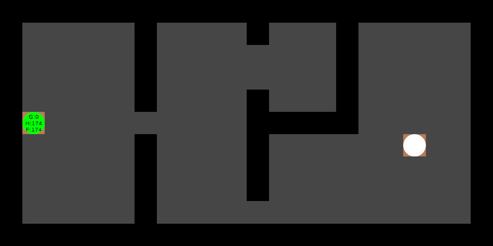

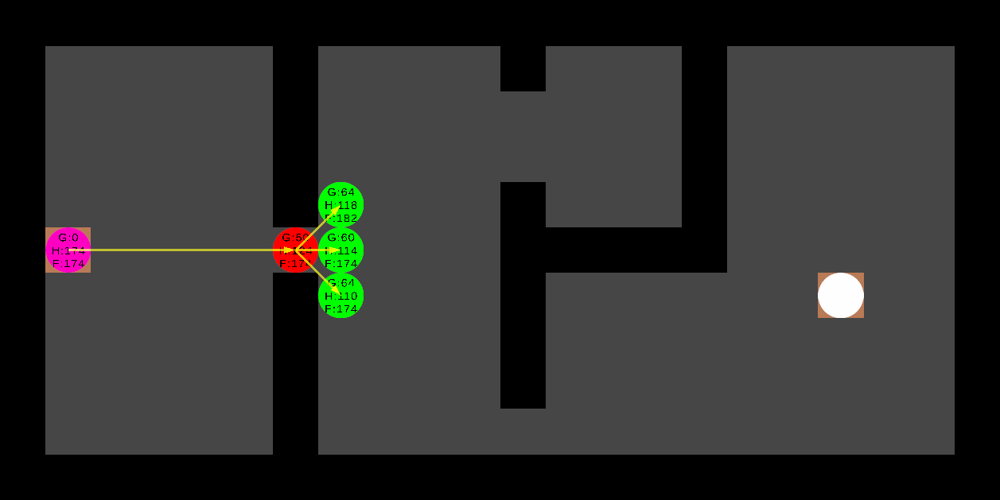

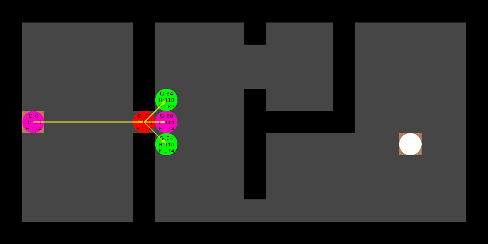

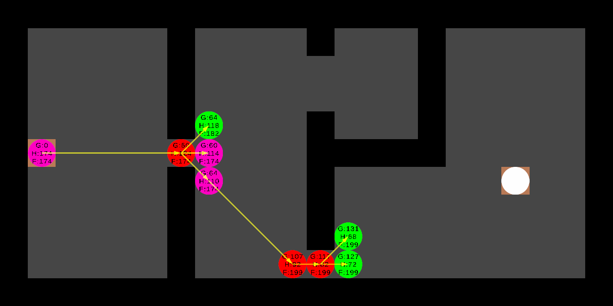

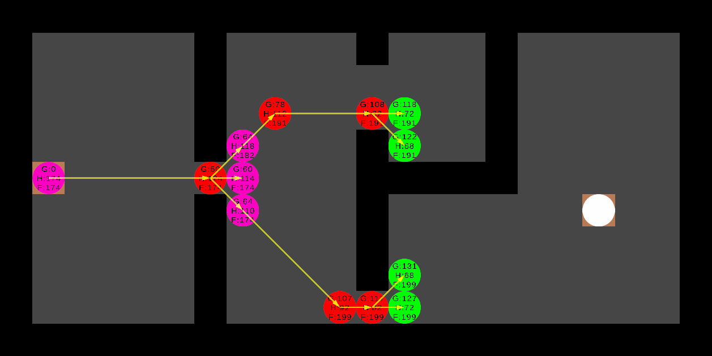

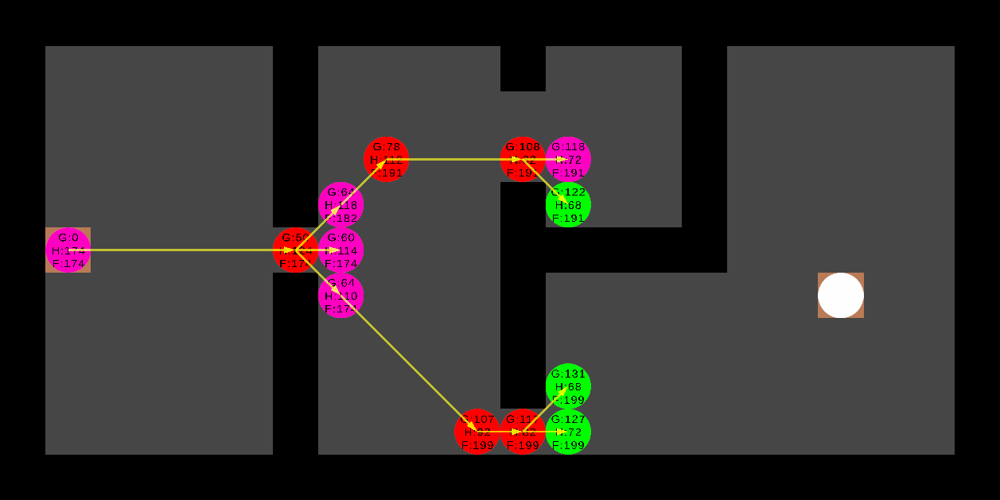

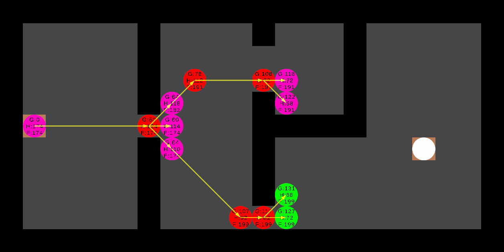

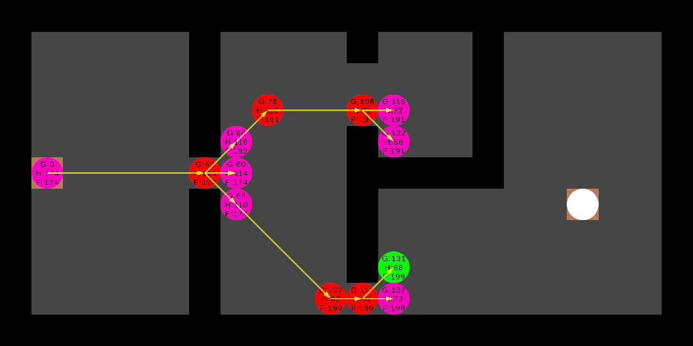

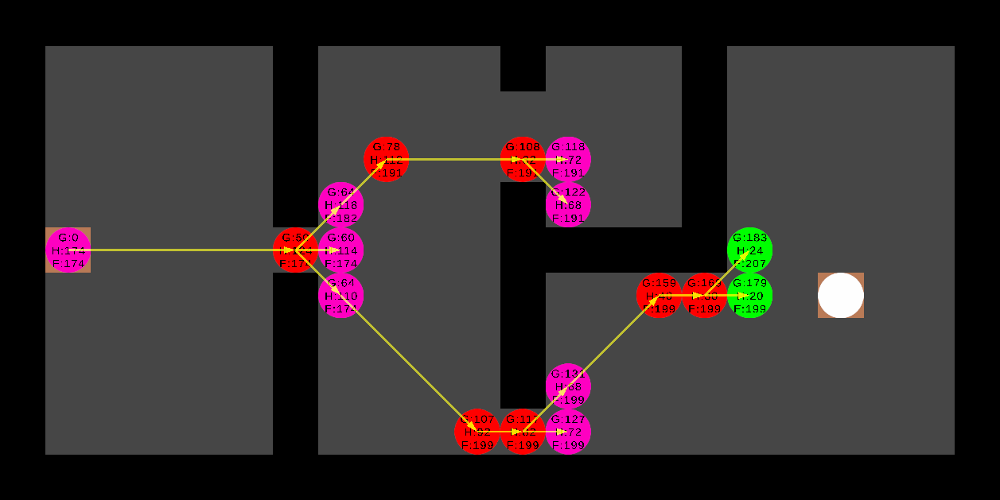

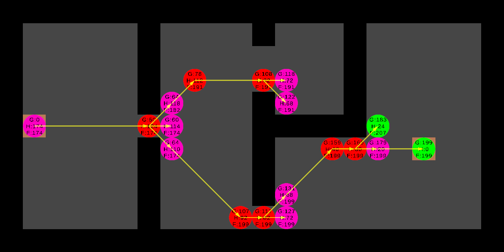

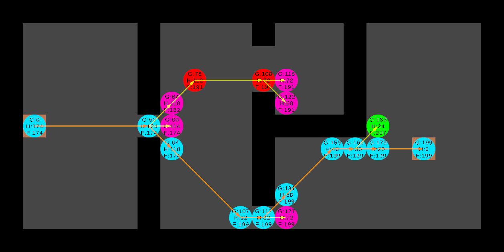
