# 基础A*寻路

## 概念


- A*算法是一种启发式算法，启发函数为FCost=GCost+HCost
- 节点：相当于图这个数据结构中的节点，并拥有一些额外属性
  - GCost：从起点到该节点的路径总长度。由于是从起点逐步搜索，起点到某点的路径是确定的，即GCost是真实的
  - HCost：从该节点到终点的路径的估计长度。最基本的做法是假设该节点到终点没有障碍物，以此计算距离
- open list：已计算FCost而从起点出发的最短路径未确定的节点，每次从中选出FCost最小的节点测试，故适合用最小堆实现
- close list：从起点出发的最短路径已经确定的节点；只要每个节点记录了自身的父节点，便不需要显式定义close list

## 自然语言描述

1. 设置起点终点，将起点加入**open**，用**N**记录最接近结果的点，**N**一开始设为起点（不论寻路是否正常完成，最终都从**N**开始回溯结果）
2. 从**open**中取出堆顶节点（记为**A**），作为被测节点
3. 获取**A**周围的若干节点，过滤掉不可通行和已测试过的节点，过滤结果记为**adjoin**
4. 对于**adjoin**中的每个节点进行以下操作：
   - 如果是终点，将该节点的父节点设为**A**，并将**N**设为该节点，然后返回结果
   - 如果是未访问过的节点，将该节点的父节点设为**A**，然后加入open
   - 如果是open中的节点，如果从**A**移动到该点比从该点原本的父节点走到该点的GCost更小，那么将该节点的父节点改为**A**
   - 如果该节点的HCost小于**N**的HCost，将**N**设为该点
5. 将**A**标记为已测试
5. 如果open不为空，回到2；否则返回结果

## 拓展

- A*算法可修改的部分主要由以下几个部分组成：
  - 计算FCost的方式
  - 计算GCost的方式
  - 判断能否从某点移动到另一点的方式
  - 获取周围节点的方式
- 从复用性和可拓展性角度考虑，可以使用委托

```c#
public class PathFindingSettings
{
    public int capacity;
    public int maxDepth;
    public Func<PathFindingProcess, float> CalculateWeight;
    public Func<Vector2Int, Vector2Int, float> CalculateHCost;
    public Func<Vector2Int, Vector2Int, float> CalculateGCost;
    public Action<PathFindingProcess, PathNode, List<PathNode>> GetAdjoinNodes;
    public Func<PathNode, PathNode, bool> MoveCheck;
    public Func<Vector2Int, ENodeType> DefineNodeType;
}
```

# 计算FCost的方式

```C#
/// <summary>
/// 规定HCost权重的方法
/// </summary>
public Func<PathFindingProcess, float> CalculateWeight;
/// <summary>
/// 计算HCost的方法
/// </summary>
public Func<Vector2Int, Vector2Int, float> CalculateHCost;
```

## 权重系数

- 启发函数变为FCost=GCost+ weight * HCost
- 可以证明：**weight * HCost < 实际距离时，算法总是能返回最短路径；权重系数越大，找到结果的速度越快**

| 权重系数 | 返回最短路径 | 说明                   |
| -------- | ------------ | ---------------------- |
| 0        | 是           | 退化为BFS/Dijkstra算法 |
| 1<       | 是           | 效率不如标准A*         |
| 1        | 是           | 标准A*                 |
| >1       | 不一定       | 效率高于标准A*         |

- 可以尝试使用动态权重系数

## 计算HCost的方式

- 可以适应不同的可选移动方向
  - 四向移动：曼哈顿距离
  - 八向移动：对角线距离
  - 六向移动

## 计算GCost的方式

```C#
/// <summary>
/// 计算GCost的方法
/// </summary>
public Func<Vector2Int, Vector2Int, float> CalculateGCost;
```

- 可以适应困难地形、不同移动方式等需求

# 判断能否从一点移动到另一点的方式

```C#
/// <summary>
/// 获取相邻节点的方法
/// </summary>
public Action<PathFindingProcess, PathNode, List<PathNode>> GetAdjoinNodes;
/// <summary>
/// 判断能否移动的方法
/// </summary>
public Func<PathNode, PathNode, bool> MoveCheck;
/// <summary>
/// 确定节点类型的方法
/// </summary>
public Func<Vector2Int, ENodeType> DefineNodeType;
```

- 可以适应的可选移动方向，以及
  - 四向移动
  - 自由八向移动
  - 受限八向移动：贴墙时不能走对角线
  - 六向移动

```C#
public static bool CheckPassable_Default(PathNode from, PathNode to)
{
    return to.Type != ENodeType.Obstacle;
}

private ENodeType DefineNodeType(Vector2Int nodePos)
{
    Vector3 world = NodeToWorld(nodePos);
    Vector3Int tilePos = map.WorldToCell(world);
    RuleTile tile = map.GetTile(tilePos) as RuleTile;
    if (tile != null)
    {
        if (tile.m_DefaultSprite.name == "Block")
            return ENodeType.Obstacle;
    }
    return ENodeType.Blank;
}
```

# 获取相邻节点的方式

```C#
/// <summary>
/// 获取相邻节点的方法
/// </summary>
public Action<PathFindingProcess, PathNode, List<PathNode>> GetAdjoinNodes;
```

## 舍弃邻域法

- 对节点按照某种方式排序，只访问排序结果为前几位的节点或满足某种标准的节点
- 以下条件可作为排序依据：
  - 当前节点的位置
  - 父节点的位置
  - 起点的位置
  - 终点的位置

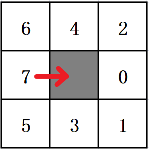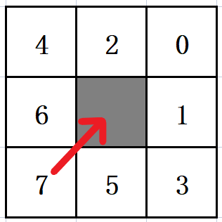

- 以8向移动，获取方向与父节点到当前节点方向更接近的若干个节点为例：
  - 舍弃不超过3个节点时，算法效率没有显著提升
  - 舍弃5个节点时，效率提升但未必会返回最短路径
  - 舍弃5个以上节点时，算法无法正常工作

## 对舍弃邻域法的一种改进

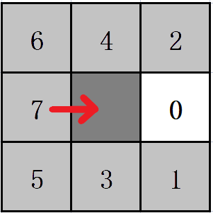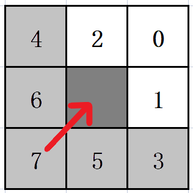

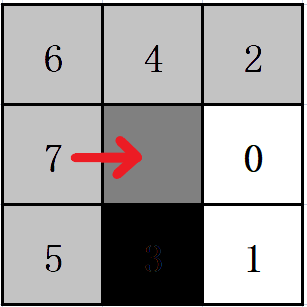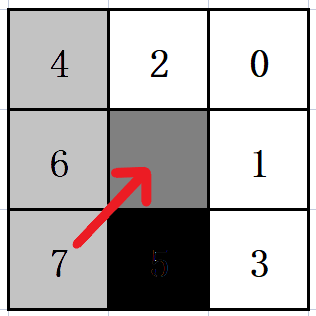

- 按上图的规则舍弃相邻节点（黑色表示障碍物，灰色表示被舍弃的节点），效率大幅提升且依然能返回最短路径

## 跳点搜索(JPS算法)

- A*算法的一个主要问题是进行了太多重复/相似/对称的运算
- 跳点搜索希望通过事先计算和验证跳过大量无意义的节点测试

### 概念


- 邻居：某节点周围的八个节点

$$
\begin{aligned}
& 若7\rightarrow A为水平或竖直线,D_{min}>D_{A时},X为自然邻居或强制邻居 \\
& 若7\rightarrow A为斜线,D_{min}\ge D_{A时},X为自然邻居或强制邻居 \\
& 自然邻居是指,不论A周围有没有障碍物,都满足上述条件的邻居X; 强制邻居是指,因为障碍物的存在,新增的满足上述条件的邻居X \\
& A:某个节点 \quad x:A的某个邻居 \quad D_A:7\rightarrow A \rightarrow X的路径长 \quad D_{min}:7\rightarrow X的所有不经过A的路径中的最短路径长
\end{aligned}
$$

### 过程图示

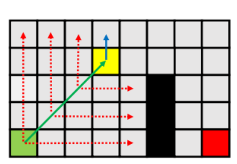

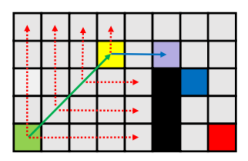

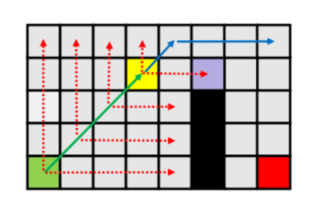

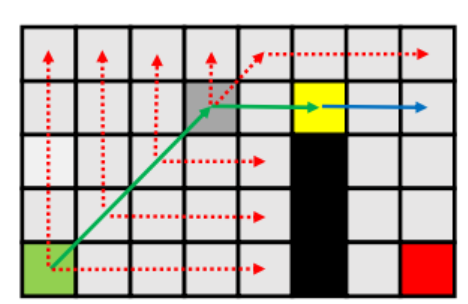

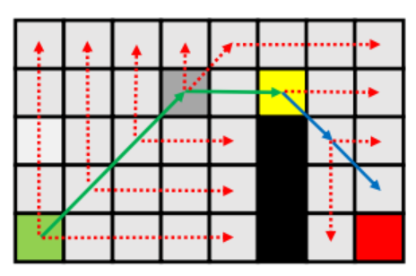

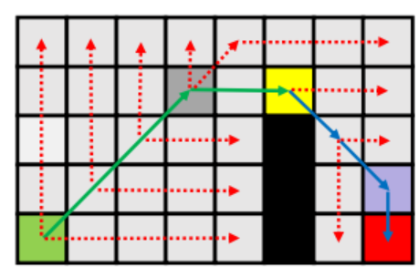

### 自然语言描述


*A星算法与JPS的算法框架依然相同，可以只修改获取相邻节点的方式，以实现JPS算法，故以下只介绍如何获取相邻节点*

1. 输入一个节点**A**
2. **A**的父节点记为**P**，对8个方向排序，排序的依据为**P**到**A**的方向（见上图）。若P为空（即A为起点），规定P到A的方向为向左（即左上图）
3. 按照以下规则确定后续节点：
   - 若P为空：1、2、5、6加入后续节点；在0、3、4、7的方向上寻找跳点（见下文）
   - 若P水平或竖直移动到A：在0的方向上寻找跳点；如果3为障碍物，1加入后续节点；如果4为障碍物，2加入后续节点
   - 若P沿对角线移动到A：在0、1、2的方向上寻找跳点；如果5为障碍物，3加入后续节点；如果6为障碍物，4加入后续节点

- 跳点：从某个点沿某方向出发，前进若干步后遇到的，应作为后续节点添加到open list的点
  - 给定一个节点和一个移动方向，确定其强制邻居，如果该点有至少一个强制邻居，或者和终点相邻，那么该点为跳点
  - 如果移动方向是对角线方向，还需额外检查：以该点为起点，分别沿该方向的水平分量和竖直分量寻找跳点，只要任一方向能找到跳点，该点也视为跳点
  - 如果碰到障碍物则停止，不加入后续节点
  - 在某个方向上的前进距离是有限制的，如果到了距离依然没有发现跳点，将最后一个节点视为跳点

# 其他拓展和优化

- 双向A*寻路
- 预处理
  - 一般意义的预处理
  - JPS+算法

- 路径曲线化
  - 由结果生成曲线
  - Hybrid A*


# 参考

Harabor D，Grastien A． Online Graph Pruning for Pathfinding on Grid Maps［C］


| 操作                           | 单次操作时间复杂度           | 执行次数     |
| ------------------------------ | ---------------------------- | ------------ |
| 从Open List中取出节点A         | $O(V)$，V为Open List中节点数 | 总测试节点数 |
| 取A的相邻节点，及对A的其他操作 | $O(1)$                       | 总测试节点数 |

