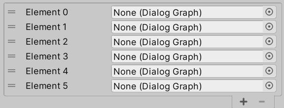

# Unity自定义编辑器

Unity引擎的许多部分都是可以自定义的，不只是游戏运行时显示的内容，还包括Scene窗口、Inspector窗口、菜单栏等。对程序和策划友好的界面有利于提高开发效率。本文主要介绍自定义Inspector窗口的基础知识，以及如何在实际项目中**便捷地**使用**Unity自带的API**自定义Inspector。

## 相关C#知识

- 反射
- 特性(Attibute)

## 基础知识

### Editor

每个`UnityEngine.Object`（如`Monobehavior`，`ScriptableObject`）都可以有对应的`Editor`类，Unity给自带的组件基本上都写了Editor。而开发者新增的组件，如果没有写Editor的话，便使用默认的Editor。实际上，`Editor`类还控制Scene窗口显示的内容等，不过本文主要介绍Inspector窗口。

`Editor`类中的`target`字段即表示正在监视的对象，比如有个组件叫`GridTransform`，那么`target as GridTransform`便可以获取该组件。

令一个类继承`Editor`，并添加Attibute：`[CustomEditor(typeof(GridTransform))]`，那么这个类就成为GridTransform的CustomEditor。

`Editor`及其子类仅在编辑器中生效，**打包时不应该被包含，所以应该放在任意一个名为Editor的文件夹中。**

要自定义Inspector面板，主要是修改`Editor`类的`OnEnable`方法和`OnInspector`方法。

### OnEnable

**Inspector面板出现时调用一次，通常在这里获取变量**


### OnInspectorGUI

**Inspector面板存在时快速反复调用，要显示的东西写在这里**


**没有自定义Editor，使用默认Editor：**

```C#
public class GridTransform : MonoBehaviour
{
    public Vector2Int position;
}
```


**空Editor取代了默认Editor：**

```c#
[CustomEditor(typeof(GridTransform))]
public class Edirtor_GridTransform : Editor
{
    protected void OnEnable(){}
    public override void OnInspectorGUI(){}
}
```


## 显示内容

要让Inspector面板显示变量等东西，主要用到`UnityEditor.EditorGUILayout`和`UnityEditor.EditorGUI`中的API。如果没有特殊要求，一般调用`UnityEditor.EditorGUILayout`，相当于`UnityEditor.EditorGUI`

```C#
[CustomEditor(typeof(GridTransform))]
public class Edirtor_GridTransform : Editor
{
    private GridTransform gridTransform;
    
    protected void OnEnable()
    {
        gridTransform = target as GridTransform;
    }
    
    public override void OnInspectorGUI()
    { 
        EditorGUILayout.BeginVertical();
        EditorGUILayout.Vector2IntField("位置", gridTransform.Position);
        EditorGUILayout.EndVertical();
    }
}
```


看起来这样可以修改内容，但发现没用。因为监视器里的值没有赋值给`GridTransform`的字段。

## 修改内容

**错误写法：**

```c#
gridTransform.Position = EditorGUILayout.Vector2IntField("位置", gridTransform.Position);
```

改成这样之后，还是没用。**不同于运行时，要在Inspector面板里修改变量，必须借助`SerializedProperty`。**

**正确写法：**

```C#
[CustomEditor(typeof(GridTransform))]
public class Edirtor_GridTransform : Editor
{
    public SerializedProperty position;
    private GridTransform gridTransform;

    protected void OnEnable()
    {
        gridTransform = target as GridTransform;
        //将Edirtor_GridTransform.position与GridTransform类中名为"position"的字段绑定
        position = serializedObject.FindProperty("position");
    }

    public override void OnInspectorGUI()
    {
        //不可缺少
        serializedObject.Update();
        
        EditorGUILayout.BeginVertical();
        
        //SerializedProperty实例无法自动确定它绑定的数据的类型，需要人为指定     
        position.vector2IntValue = EditorGUILayout.Vector2IntField("位置", position.vector2IntValue);

        EditorGUILayout.EndVertical();
        
        //不可缺少
        serializedObject.ApplyModifiedProperties();
    }
}
```

**标准步骤：**

1. **在OnEnable中将一个需要显示并修改的变量与一个`SerializedProperty`绑定**
2. 继承OnInspectorGUI，添加**`serializedObject.Update(); ` ` serializedObject.ApplyModifiedProperties()`**语句
3. **调用API显示并获取值，赋值给`SerializedProperty`**

当然，并不是只能原模原样地显示修改一个字段，可以经过一些处理和运算。

## 更简便地自定义Inspector

### 获取SerializedProperty

字段多了以后，定义和获取SerializedProperty会变得非常繁琐。下面是Unity官方URP插件的一个Editor脚本的部分代码，可以看出非常繁琐

```C#
void OnEnable()
{
    m_LightType = serializedObject.FindProperty("m_LightType");
    m_LightColor = serializedObject.FindProperty("m_Color");
    m_LightIntensity = serializedObject.FindProperty("m_Intensity");
    m_UseNormalMap = serializedObject.FindProperty("m_UseNormalMap");
    m_ShadowIntensity = serializedObject.FindProperty("m_ShadowIntensity");
    m_ShadowVolumeIntensity = serializedObject.FindProperty("m_ShadowVolumeIntensity");
    m_ApplyToSortingLayers = serializedObject.FindProperty("m_ApplyToSortingLayers");
    m_VolumetricAlpha = serializedObject.FindProperty("m_LightVolumeOpacity");
    m_BlendStyleIndex = serializedObject.FindProperty("m_BlendStyleIndex");
    m_FalloffIntensity = serializedObject.FindProperty("m_FalloffIntensity");
    m_PointZDistance = serializedObject.FindProperty("m_PointLightDistance");
    m_LightOrder = serializedObject.FindProperty("m_LightOrder");
    m_AlphaBlendOnOverlap = serializedObject.FindProperty("m_AlphaBlendOnOverlap");
    //其余略
}
```

理论上我们调用`FindProperty`只需要两个信息：告诉程序哪些SerializedProperty要调用`FindProperty`(**不是所有SerializedProperty都通过`FindProperty`获取**)，以及原变量的名称。假如再规定，SerializedProperty必须和原变量重名，那么只需要标明哪些SerializedProperty需要调用`FindProperty`，这可以通过一个无参Attribute实现。

没法直接修改默认的Editor，所以需要自己写一个类，就叫`AutoEditor`，然后让`AutoEditor`取代`Editor`作为所有自定义Editor的父类。

```C#
//无参特性，仅作为标记使用，被此特性标记的字段自动调用FindProperty
[AttributeUsage(AttributeTargets.Field)]
public class AutoAttribute : Attribute{}
```

```C#
public abstract class AutoEditor : Editor
{
    protected virtual void OnEnable()
    {
        //获取自身所有字段
        FieldInfo[] infos = GetType().
            GetFields(BindingFlags.Instance | BindingFlags.Public | BindingFlags.NonPublic);
        if (target != null)
        {
            foreach (FieldInfo info in infos)
            {
                //筛选出具有AutoAttribute特性的SerializedProperty字段
                if (info.GetAttribute<AutoAttribute>() != null 
                    && info.FieldType == typeof(SerializedProperty))
                    //自动调用FindProperty，参数设置为与变量名相同
                    info.SetValue(this, serializedObject.FindProperty(info.Name));
            }
        }
    }
    public override void OnInspectorGUI()
    {
        serializedObject.Update();
        EditorGUILayout.BeginVertical();
        MyOnInspectorGUI();
        EditorGUILayout.EndVertical();
        serializedObject.ApplyModifiedProperties();
    }
    protected abstract void MyOnInspectorGUI();
}
```

### 调用API

```c#
position.vector2IntValue = EditorGUILayout.Vector2IntField("位置", position.vector2IntValue);
```

上面这句API调用也显得有些繁琐，因为绝大部分情况下都是显示并可以在编辑器中修改一个值。所以理论上只需要提供变量的类型、变量在Inspector面板的名字这两个信息，如果要大量调用这些API，有必要包装一下。

```c#
 public static void Vector2IntField(this SerializedProperty property, string label)
            => property.vector2IntValue = EditorGUILayout.Vector2IntField(label, property.vector2IntValue);
```

API调用简化为：

```C#
position.Vector2IntField("位置");
```

其实没有简化到极致，可以给`AutoAttribute`加几个参数，表示变量类型、在Inspector面板中的名称、位置、顺序、尺寸等等，连API调用都不用写了。不过要实现这些过于复杂了。

## 复杂功能

显示和修改**基础数据类型**都很简单，查阅官方文档即可，不赘述。提一下几种复杂一点的功能。

### 显示枚举

涉及到整数与**类型未知**的枚举相互转换的问题

```c#
public static T ToEnum<T>(this int enumIndex) where T : Enum
    =>(T)Enum.ToObject(typeof(T), enumIndex);
public static int ToInt(this Enum e)
    =>e.GetHashCode();
public static void EnumField<T>(this SerializedProperty property, string label) where T : Enum
 => property.enumValueIndex = EditorGUILayout.EnumPopup(label, property.enumValueIndex.ToEnum<T>()).ToInt();
```

### 显示数组、列表

注意`PropertyField`的第三个参数

```C#
public static void ListField(this SerializedProperty property, string label)
    => EditorGUILayout.PropertyField(property, new GUIContent(label), true);
```

### 自定义Inspector的“嵌套”

比如有一个数据类A，它本身不继承`UnityEngine.Object`所以不能为它写CustomEditor。而它被一个继承`Monobehavior`的B持有，现在要修改A在B的Inspector中的样式。

关键的API是`serializedProperty.FindPropertyRelative(string)`。在上面这个例子里，先让B和一个SerializedProperty（记为C）绑定，然后`SerializedProperty D = C.FindPropertyRelative("XXX")`即可让D绑定B中的字段。同样地，为了避免在调用API的时候反复输入变量名称，继续使用上面的`AutoAttribute`特性，并包装一下。

```c#
 public abstract class IndirectEditor
 {
     public bool foldout;
     public string m_label;
     //在AutoEditor的OnEnable中调用此方法
     public virtual void Initialize(SerializedProperty serializedProperty, string label)
     {
         FieldInfo[] fields = GetType().GetFields(BindingFlags.Instance | BindingFlags.Public | BindingFlags.NonPublic);
         foreach (FieldInfo info in fields)
         {
             if (info.HasAttribute<AutoAttribute>() && info.FieldType == typeof(SerializedProperty))
                 info.SetValue(this, serializedProperty.FindPropertyRelative(info.Name));
         }
         foldout = false;
         m_label = label;
     }
     //在AutoEditor的OnInspectorGUI中调用此方法
     public virtual void OnInspectorGUI(bool foldable = true)
     {
         if (foldable)
         {
             foldout = EditorGUILayout.BeginFoldoutHeaderGroup(foldout, m_label);
             if (foldout)
                 MyOnInspectorGUI();
             EditorGUILayout.EndFoldoutHeaderGroup();
         }
         else
             MyOnInspectorGUI();
     }
     protected abstract void MyOnInspectorGUI();
 }
```

从具体项目中取出的例子（需要与上面提到的几个类一起使用）：

```c#
public class Character: Monobehavior
{
	public CharacterData data;
}
```

```C#
public struct CharacterData
{
    public float speed;
    public float visibility;
    public float view;
}
```

```C#
public class IndirectEditor_CharacterData : IndirectEditor
{
    [Auto]
    public SerializedProperty speed, visibility, view;

    protected override void MyOnInspectorGUI()
    {
        speed.FloatField("速度");
        visibility.FloatField("可见度");
        view.FloatField("视野");
    }
}
```

```C#
[CustomEditor(typeof(Character), true)]
public class Editor_Character : AutoEditor
{
    public IndirectEditor_CharacterData editor_data;

    protected override void OnEnable()
    {
        base.OnEnable();
        editor_data = new IndirectEditor_CharacterData();
        editor_data.Initialize(data, "当前数值");
    }

    protected override void MyOnInspectorGUI()
    {
        editor_data.OnInspectorGUI();
    }
}
```

### ReoderableList

可以通过拖拽排序的列表，虽然官方提供了一些API，实现起来依然复杂，效果如下图(其实不写CustomEditor就能获得这种效果，但写了CustomEditor想要复现却很复杂)：



教程：https://blog.csdn.net/alexhu2010q/article/details/122210800


上面的代码基本是我自己边看文档边用摸索出来的，如果有错误，欢迎通过QQ告诉我。

QQ：1657125180
