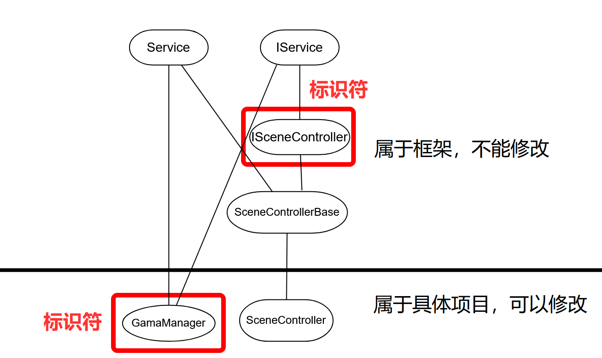
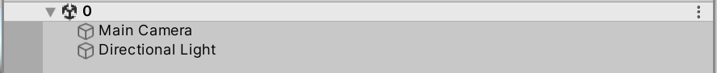
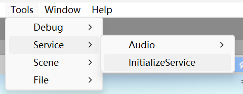
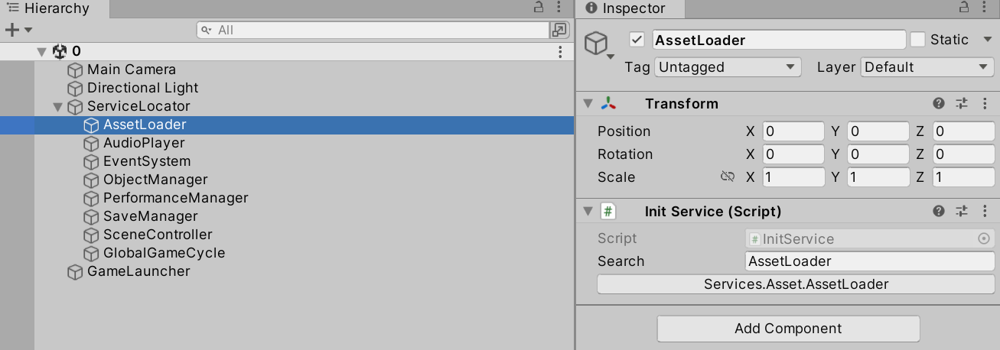
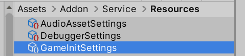
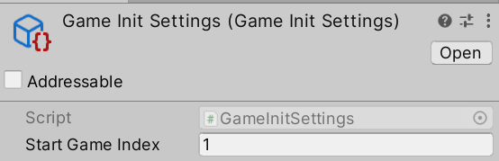

# 代码

## Service和ServiceLocator

- **各种需要全局可获取的实例，可以不用单例，而是改为继承`Service`；`ServiceLocator`提供了获取这些实例的手段，以及更完善的管理这些类的手段**
- **`ServiceLocator`是静态类。所有实例可以通过`ServiceLocator`获取注册到`ServiceLocator`的`Service`实例**
- **下文中，用A表示任意一个继承了`Service`的类的实例**
- **A具有服务的典型行为：**
  - A在`Awake`时，会将自身注册到`ServiceLocator`中
  - A在`Start`时，会进行自身的初始化
  - A在`Destroy`时，会将取消注册（将自身从`Servicelocator`中）

- `ServiceLocator`用字典存储所有A（字典的Key就是A的标识符，以下称为**标识符**）。
  - 每个标识符不能相同，而标识符实际上是`Type`类的实例，这意味着A具有类似单例的性质
  - A有`RegisterType`属性，A的标识符实际上是`A.RegisterType`，且所有标识符必须直接或间接地实现或继承`IService`；一种很自然的想法是，用`A.GetType()`作标识符，但实际上`A.RegisterType`有时不等于`A.GetType()`（见下文`IService`）
  - A的注册、取消注册以及从`ServiceLocator`获取A，都需要提供A的标识符

- 创建新的A时的注意事项：
  - 要实现其初始化逻辑，应当重写`Init`，而不是`Awake`或`Start`
  - A执行完自身的`Start`函数后，初始化才完成；其他脚本如果对A有依赖，必须考虑A的初始化是否已完成
  - 理论上，只要确保依赖不出问题，可以在任何时候创建和销毁A，这比单例更灵活；不过对于小型项目而言，几乎所有的A都会在游戏开始时创建，生命周期持续整个游戏，所以**通常会专门创建一个场景，用于初始化几乎所有A，等初始化完毕后，再加载下个场景（即游戏的具体内容）**

- **所有实例都可以通过`ServiceLocator.Get`来获取A，而多个A之间可以通过`AutoServiceAttribute`相互获取**
  - 只要了解框架，便能够确定获取A时要提供什么标识符；如果实在不确定，可以使用`RegisterType`属性
  - 如果提供了字典中不存在的标识符，程序会尝试自动修正错误：遍历A直接或间接实现的所有接口，如果找到一个D类接口，就转而以该接口为标识符

## IService

- 如果一个接口**直接继承**`ISerivce`接口，那么称之为**D类接口**
- **理论上，只需要`ServiceLocator`和`Service`，框架就能正常工作。引入`IService`和D类接口主要是出于开闭原则的考虑**
- `IService`接口本身不包含任何实际功能，而是一种“身份标记”，比如上文提到，所有标识符必须直接或间接地实现或继承`IService`
  - 实际功能在`Service`类中，如果不希望某个类具有服务的典型行为，也可以仅实现`IService`而不继承`Service`


**假设没有`IService`，所有A用`A.GetType()`作为标识符：**

```c#
public class SceneControllerBase : Service
{
    protected Type RegesterType => GetType();
}
public class SceneController :SceneControllerBase
{
    
}
public sealed class EventSystem : Service,IService
{
    public SceneControllerBase sceneController;
    
    protected internal override void Init()
    {
        base.Init();
        sceneController=ServiceLocator.Get<SceneControllerBase>();
		//改为“ServiceLocator.Get<SceneController>();” ? 
    }
}
```

`SceneControllerBase`类包含了加载场景需要的基本方法，是所有项目通用的一个类。在一个具体项目中，由于具体需求产生，需要继承重写`SceneControllerBase`，于是就有了`SceneController`

`EventSystem`类也是所有项目通用的类（换句话说就是框架的一部分），而`EventSystem`类中需要访问`SceneControllerBase`。在一个具体项目中，由于`SceneController`出现，标识符从`SceneControllerBase`变为了`SceneController`，导致`EventSystem`中的代码也必须修改，这显然不符合开闭原则


**引入接口后：**

```c#
public class SceneControllerBase : Service,ISceneController
{
    protected override Type RegesterType => typeof(ISceneController);
}
public class SceneController :SceneControllerBase
{ 
}
public sealed class EventSystem : Service,IService
{
    public ISceneController sceneController;
    
    protected internal override void Init()
    {
        base.Init();
        sceneController=ServiceLocator.Get<ISceneController>();	//不用修改
    }
}
```

要解决上述问题，让`SceneController`和`SceneControllerBase`使用相同的标识符即可（在这个例子中，标识符就是`ISceneController`）。在此基础上，出于便捷和可靠性等考虑，又引入了`ISevice`和D类接口，以及与之相关的一些方法


**但并不是所有A都需要像上面这样做，如果在一个具体项目中，新创建了一个类，这个类应当继承`Service`，且与框架无关。如果仿照上面，为这个类也创建一个D类接口，显得有些麻烦了，这种情况下，可以跳过D类接口：**

```c#
public class GameManager : Service,IService
{
    protected override Type RegesterType => typeof(GameManager);
}
public sealed class Player : Monobehavior
{
    public GameManager gameManager;
    
    private void Awake()
    {
        gameManager=ServiceLocator.Get<GameManager>();	//因为不属于框架,所以不用顾虑开闭原则
    }
}
```

`GameManager`是仅存在于某个具体项目中的类，且开发者不希望为其新增一个接口，便令其直接实现`IService`，上述代码中便不存在D类接口

**总之，关于是否要使用D类接口，可以参考这张图：**



为了让`SceneControllerBase`在多个项目中通用，`SceneControllerBase`必须具有可移植性，这正是引入`ISceneController`的原因。而`GameManager`仅仅存在于某个特定项目中，为其引入一个接口是多余的

# 工作流

## 编辑器模式Service初始化

- **游戏运行前，需要将各种A添加到场景中，这一过程称为编辑器模式Service初始化；**为了方便初始化，专门写了一些编辑器模式代码；编辑器模式Service初始化具体过程如下：

1. 创建一个空场景，作为初始场景（`MenuTool`脚本中有一个方法提返回初始场景的快捷键，注意初始场景的命名和该方法的关系）



2. 点击下图所示的按钮，便会自动创建出需要的游戏物体和脚本



3. `GameLaucher`和`ServiceLocator`上的脚本不需要修改。`ServiceLocator`下的每个游戏物体对应了一个D类接口。由于可能有若干个类直接或间接地实现D类接口，无法自动确定要创建其中的哪一个，所以还需要人为添加Service脚本（**各种Service并不是一定要在0场景创建好。也可以运行时动态创建**）
4. 为了方便人为添加`Service`，使用`InitService`脚本。`InitService`脚本没有具体功能，其作用仅仅是便捷地**替换出**各种`Service`。下图中，`Search`变量即相当于搜索栏，搜索名称包含该字符串且继承了`Service`的脚本；下方的按钮代表搜索结果，点击按钮，便会把`InitService`脚本替换为搜索到的脚本



## 运行时Service初始化

- 运行时初始化是指，游戏运行起来后，各个A初始化的过程

- 为了正确的初始化，游戏运行前还需要进行以下设置：



在文件夹中找到上图所示的`ScriptableObject`（如果没有，就创建一份，命名不能修改），设置好其中的属性。`StartGameIndex`指的是，运行时Service初始化完成后，**要加载的场景的序号**（见BuildSetting）

**初始化过程中，方法调用顺序：**

1. 逐个调用0场景中每个脚本的`Awake`与`OnEnable`方法
   - 各种A将自身注册到`ServiceLocator`（此时还不能获取其他`Service`）
2. 逐个调用0场景中每个脚本的Start方法
   - 各种A获取其他A，然后执行自身的初始化方法
   - `GameLaucher`脚本等待1秒
3. 等待游戏启动
   - `GameLaucher`等待好后，一旦游戏的初始化任务数降为0，便启动游戏，加载StartGameIndex指定的场景
