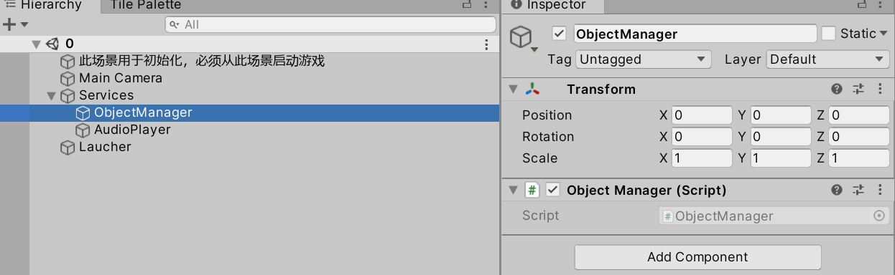
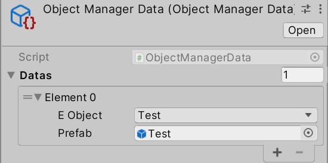

## IObject

- 由对象池管理的物体需要实现此接口

## MyObject

- 对`GameObject`的相关API进行了封装，创建/激活，禁用/销毁`MyObject`时，**不要使用原本的API**。创建对象时，如果希望它受对象池管理，调用`ObjectPoolManager`的`Activate`函数即可；如果希望不依赖对象池，直接克隆**带有`MyObject`的prefab**，调用`ObjectPoolUtility.Clone`
- 在对象池里创建对象时，该游戏物体上的脚本的`Awake`和`OnEnable`会被调用，不过该游戏物体随即会被禁用，所以不会调用Start，会调用`OnDisable`。如果一个脚本和`MyObject`挂在一个游戏物体上，谨慎使用其`Awake`、`Start`、`OnEnable`、`OnDisable`，必要时用`MyObject`的`OnActivate`、`OnRecycle`代替`OnEnable`、`OnDisable`

- 假如你已经给游戏中一种具体的物体创建好了prefab，并希望它受对象池管理，通常，为该prefab添加`MyObject`组件，并使你的脚本持有`MyObject`即可（而不是让你的脚本实现`IObject`）

## ObjectPool

- 管理一种游戏物体的对象池，使用枚举作为不同对象的标识符
- 对象不足时，会自动创建新对象，所以对象没有被正确地回收也不会引发严重问题
- 可以手动预生成一些对象

## ObjectPoolManager

- 管理所有`ObjectPool`
- 试图激活某种对象时，便会自动创建对应的ObjectPool

## 工作流

1. 创建ObjectPoolManager（如果没有的话），确保其所在的游戏物体不会被摧毁

2. 创建prefab，通常，该游戏物体包含`MyObject`组件和其他具体逻辑相关的组件

3. 在EObject类添加一个枚举常量，找到ObjectManagerData这个ScriptableObject，在其中添加一项，将枚举与prefab绑定
4. 之后调用`ObjectManager`等类中的API即可