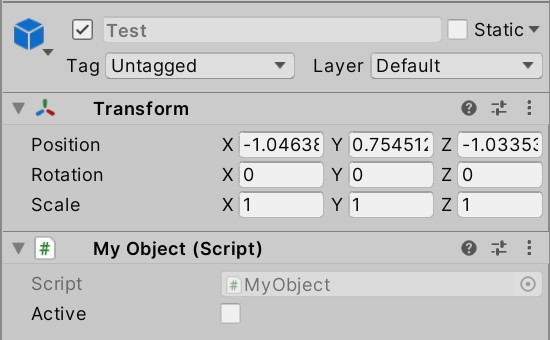
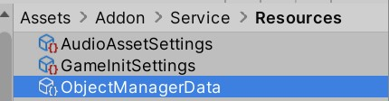

# 代码

## MyObject

- `MyObject`与一般的`Monobehavior`的区别主要是多了`OnActivate`和`OnRecycle`，这两个委托与`OnEnable`和`OnDisable`类似：
  - 用Unity原本的API创建带有`MyObject`的游戏物体时，会依次调用`Awake`，`OnEnable`，`Start`
  - 在对象池中生成游戏物体时，会依次调用`Awake`，`OnEnable`，`OnDisable`（在对象池中创建时，会立刻将游戏物体禁用；等到要用时再激活，所以不会调用`Start`）
  - 激活对象池中的游戏物体时，会依次调用`OnEnable`，**`OnActivate`**（如果是第一次激活，还会调用`Start`）
  - 将一个游戏物体回收到对象池中时，会依次调用`OnDisable`，**`OnRecycle`**
- **假设已经创建好了一个prefab，并希望可以通过对象池来管理该prefab，为该prefab额外添加`MyObject`组件即可**
  - 对于该prefab上的所有脚本，`Awake`，`OnEnable`，`OnDisable`要谨慎使用（仔细看上文），必要时将原本写在`Awake`，`OnEnable`，`OnDisable`中的方法改为注册到`OnActivate`和`OnRecycle`中
  - 其他脚本不要试图继承`MyObject`，要访问`OnActivate`和`OnRecycle`时，持有`MyObject`即可

## IObject

- 实际上，对象池仅要求其管理的游戏物体上有脚本实现此接口，而不必带有`MyObject`脚本
- 如果希望自定义对象池管理的游戏物体的行为，可以仅实现`IObject`，而不使用`MyObject`（通常不会这样做）

## ObjectPool

- 每个`ObjectPool`管理一种游戏物体；使用字符串作为不同游戏物体的标识符
- 对象不足时，会自动创建新对象（如果对象没有被正确回收，会创建大量对象）
- 可以人为指定预生成一些游戏物体，以降低之后的负载

## ObjectPoolManager

- 所有脚本要使用对象池时，获取`ObjectPoolManager`
- 每种游戏物体都有标识符，向`ObjectPoolManager`提供标识符以激活游戏物体

## ObjectLocator

- `ObjectLocator`实现标识符到游戏物体的映射；通常，映射方式与资源加载方式密切相关

# 工作流

1. 添加`ObjectManager`（通常，这一步应该在编辑器模式Service初始化时完成）

2. 创建要用的prefab。通常，该prefab应当带有`MyObject`组件和其他与具体逻辑相关的组件

3. 根据`ObjectLocator`的逻辑，确定这个prefab的标识符
4. 激活对象池中的游戏物体时，通常使用`ObjectManager.Activate`；要回收一个已知的游戏物体，可以使用`MyObject.Recycle`；也可以用`ObjectPoolUtility.RecycleMyObjects`回收一个游戏物体及其子物体中所有`MyObjects`