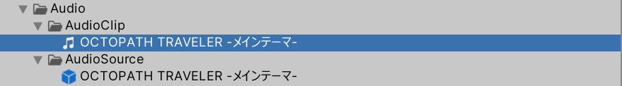
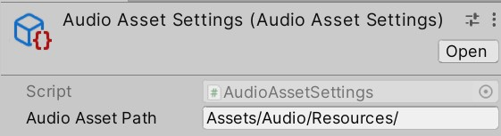
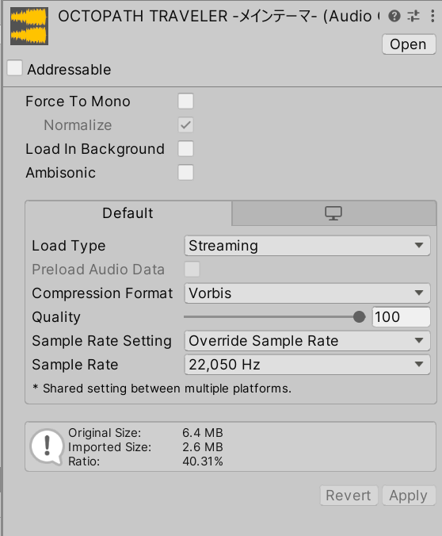
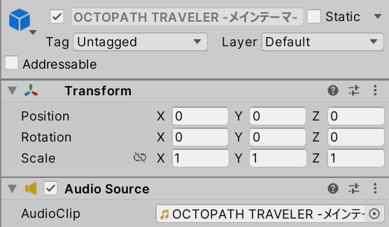

## 配置路径

创建一个文件夹用于存放AudioClip和带有AudioSource的Prefab。文件夹的命名与资源加载方式有关

找到上图中的文件（如果没有，就在上图所示的位置创建一份），输入之前创建出的放prefab的文件夹的路径

## 导入AudioClip

导入AudioClip后，根据音频类型修改导入设置（使用Preset，如果有的话）

## 创建Prefab

**选中位于任何位置的若干个AudioClip资产，然后按Shift+A，这样就会在之前创建的文件夹里创建出若干个prefab**（这不是Unity自带的功能，是代码实现的）

## 播放音频

- 要播放音频，有两种方法（`AudioPlayerBase`中有相应的API）：
  - 运行时，加载一个AudioClip资源，创建一个游戏物体，然后将AudioClip挂载到游戏物体上，播放完后销毁该游戏物体
  - 先创建一个Prefab，将要播放的AudioClip挂载到Prefab上；运行时，加载Prefab资源，然后克隆即可
- 经常有播放音频前调整其参数的需求，将AudioClip事先挂载到游戏物体上可以很方便地调整其参数。但是，如果音频数量很多，第二种方法会给文件管理带来麻烦。所以，第二种方法用在小型项目中很方便，但不适用于大型项目。在大型项目中，需要引入第三方插件，专门管理音频参数
