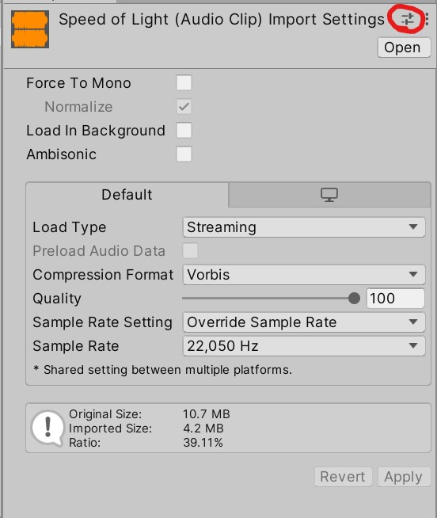
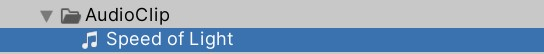
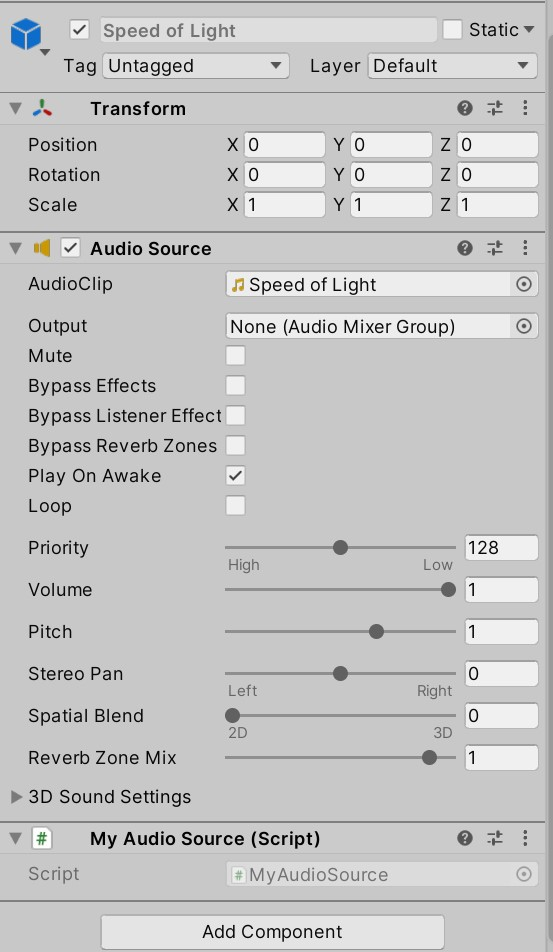

## 配置路径

创建一个文件夹用于存放接下来要创建的prefab。文件夹命名受到资源加载方式影响

找到上图中的文件，输入之前创建出的放prefab的文件夹的路径

## 导入AudioClip

导入AudioClip后，根据音频类型修改导入设置（使用Preset，如果有的话）

## 创建Prefab

选中位于任何位置的**若干**个AudioClip资产，然后按Shift+A，这样就会在之前创建的文件夹里创建出若干个prefab

之所以事先创建出prefab而不是运行时再加载AudioClip，是为了方便在运行前调整各个音频的参数

## 播放音频

调用`AudioPlayer`中的API即可。每次播放音频时，会创建一个prefab，待播放完成后自动销毁（可选的）
