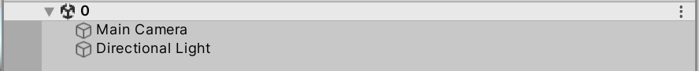
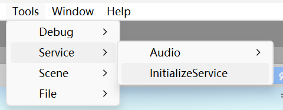
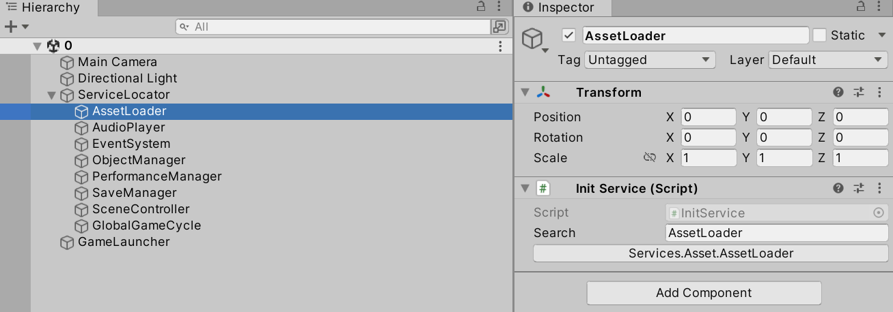
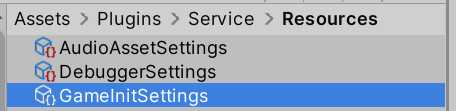
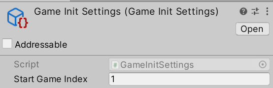

# 代码

## IService

- IService是最基本的接口。每个**直接继承IService的每种接口（以下称为D类接口）**分别代表了一种功能/服务
- 可能会有若干个不同的类直接或间接地实现D类接口，它们代表了同一种功能的不同实现
- 通常，对于每个D类接口，同时至多有一个实现该接口的实例存在

## Service

- 各种适合写成单例的类，可以不写成单例，而是继承Service，Service类会自动将自身注册到ServiceLocator
- Service实例要获取其他Service实例，仅仅在变量上添加`[Other]`特性即可

- 非Service实例要获取Service实例，访问`ServiceLocator`

- 初始化应当写在`Initialize`方法中，而不是`Awake`或`Start`

## ServiceLocator

- 唯一的静态类，用于获取各种Service
- 各种Service是通过Type来区分的。获取Service子类时要指定Type。这个Type不是要获取的类的Type，而是该类实现的D类接口的Type
- 对于每个D类接口，同时至多有一个实现该接口的实例存在，但运行前或运行时，该实例可能会改变。如果以D类接口的类型为参数，当实现D类接口的具体Service改变时，获取Service的语句就不用修改了。这里的思想参考了服务定位器模式和依赖倒置

# 工作流

## 编辑器模式Service初始化

**编辑器模式Service初始化指的是，在运行前创建好带有各种Service脚本，以及启动游戏所需的脚本**

创建一个空场景，作为初始场景（`MenuTool`脚本中有一个方法实现了快速键返回初始场景，注意初始场景的命名和该方法的关系）

点击上图所示的按钮，便会自动创建出需要的游戏物体和脚本

GameLaucher和ServiceLocator上的脚本不需要修改。ServiceLocator下的每个游戏物体对应了一个D类接口。由于可能有若干个类直接或间接地实现D类接口，无法自动确定要创建其中的哪一个，所以还需要人为添加Service脚本（**各种Service并不是一定要在0场景创建好。如果希望使用时再创建，需要另写逻辑**）

为了方便人为添加Service，使用InitService脚本。InitService脚本没有具体功能，其作用仅仅是便捷地替换出其他Service。Search变量即相当于搜索栏，搜索名称包含该字符串且类型为Service子类的脚本；下方的按钮是搜索结果，选择其中一个点击，便会把InitService组件替换成该组件

## 运行时Service初始化

在文件夹中找到上图所示的ScriptableObject（如果没有，就创建一份，命名不能修改），设置好其中的属性。StartGameIndex指的是，运行时Service初始化完成后，要加载的场景的序号

**方法调用顺序：**

1. 逐个调用0场景中每个脚本的Awake与OnEnable方法
   - 各种Service将自身注册到ServiceLocator（此时还不能获取其他Service）
2. 逐个调用0场景中每个脚本的Start方法
   - 各种Service获取其他Service，然后执行自身的初始化方法
   - `GameLaucher`脚本等待1秒
3. 等待游戏启动
   - `GameLaucher`等待好后，一旦游戏的初始化任务数降为0，便启动游戏，加载StartGameIndex指定的场景

