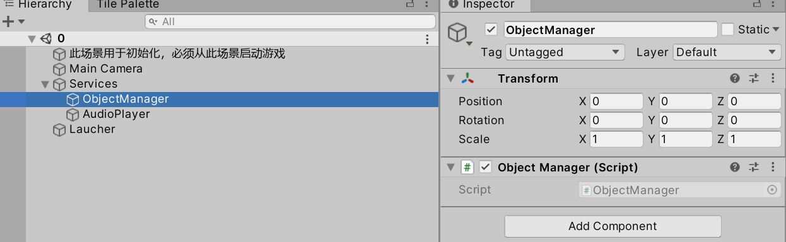
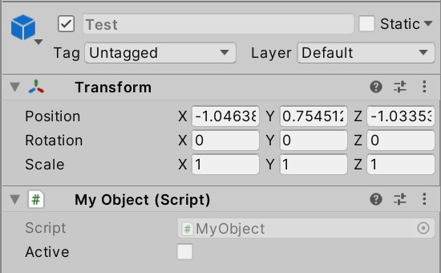
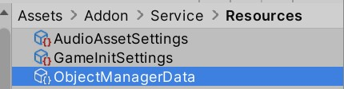

# 代码

## IObject

- 由对象池管理的物体需要实现此接口
- 通常，不主动实现这一接口，而是使用`MyObject`类

## MyObject

- 对`GameObject`的相关API进行了封装，**创建/激活，禁用/销毁`MyObject`时，不要使用Unity原本的API(比如，要创建带有`MyObject`的游戏物体，使用`ObjectPoolUtility.Clone`，而不是`Object.Instantiate`)**
- 假设已经创建好了一个prefab，并希望运行时可以通过对象池来复制该prefab，为该prefab添加`MyObject`组件即可。如果要访问该prefab的`MyObject`，让其他脚本持有`MyObject`即可（而不是让其他脚本实现`IObject`，更不是让其他脚本继承`MyObject`）
- 运行时，要通过对象池复制prefab，直接调用`ObjectPoolManager`的`Activate`函数即可，对象池中对象不足时会自动生成游戏物体
- `MyObject`类脱离对象池也可以正常使用
- 对象池创建游戏物体时，该游戏物体上的所有脚本的`Awake`和`OnEnable`就会被调用，不过该游戏物体随即会被禁用，所以不会调用Start，还会调用`OnDisable`。如果一个脚本和`MyObject`挂在一个游戏物体上，谨慎使用其`Awake`、`Start`、`OnEnable`、`OnDisable`，必要时用`MyObject`的`OnActivate`、`OnRecycle`（这两个方法在刚创建时不会被调用）代替`OnEnable`、`OnDisable`

## ObjectPool

- 每个`ObjectPool`管理一种游戏物体；使用字符串作为不同游戏物体的标识符
- 对象不足时，会自动创建新对象，所以即使对象没有被正确地回收，也不会导致崩溃
- 可以人为指定预生成一些游戏物体，以降低之后的负载

## ObjectPoolManager

- 管理所有`ObjectPool`
- 试图激活某种对象时，便会自动创建对应的ObjectPool，不需要人为创建ObjectPool

## ObjectLocator

- 每种游戏物体都有一个标识符
- 标识符到游戏物体的映射规定在`ObjectLocator`中；通常，映射方式与资源加载方式密切相关

# 工作流

1. 创建ObjectManager，并确保其所在的游戏物体不会被摧毁（通常，这一步应该在编辑器模式Service初始化时完成）

2. 创建要用的prefab。通常，该prefab应当带有`MyObject`组件和其他与具体逻辑相关的组件

3. 确定这个prefab的标识符。首先要确定项目中的资源加载方式，然后根据资源加载方式，在ObjectLocator中确定标识符到prefab的映射
4. 之后调用`ObjectManager`等类中的API，通过标识符激活对应的游戏物体即可